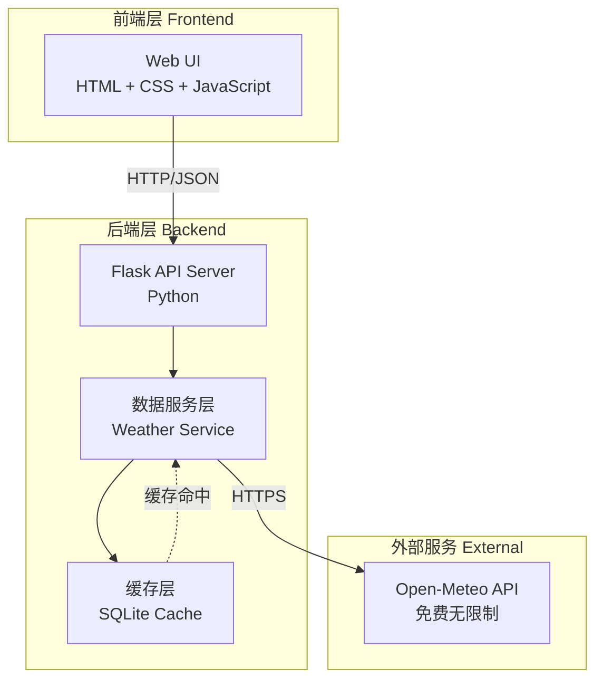
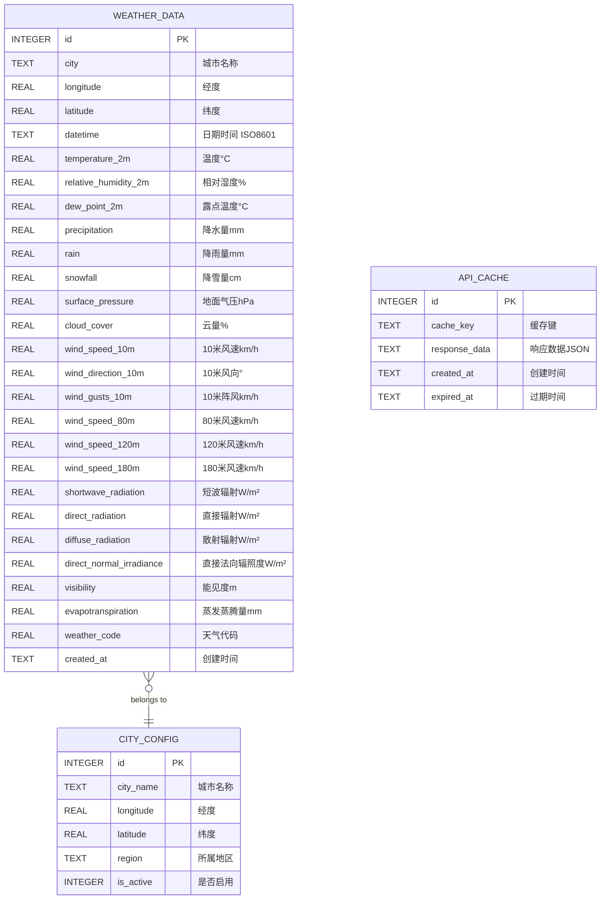
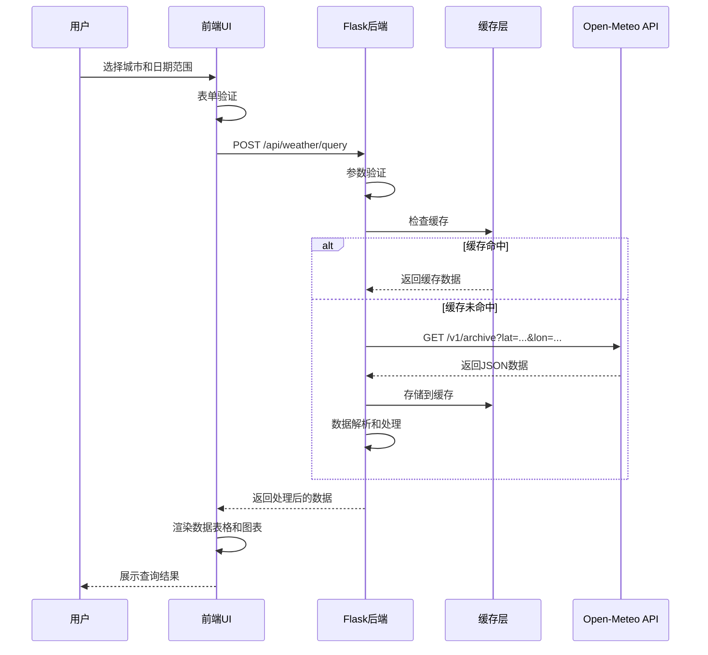
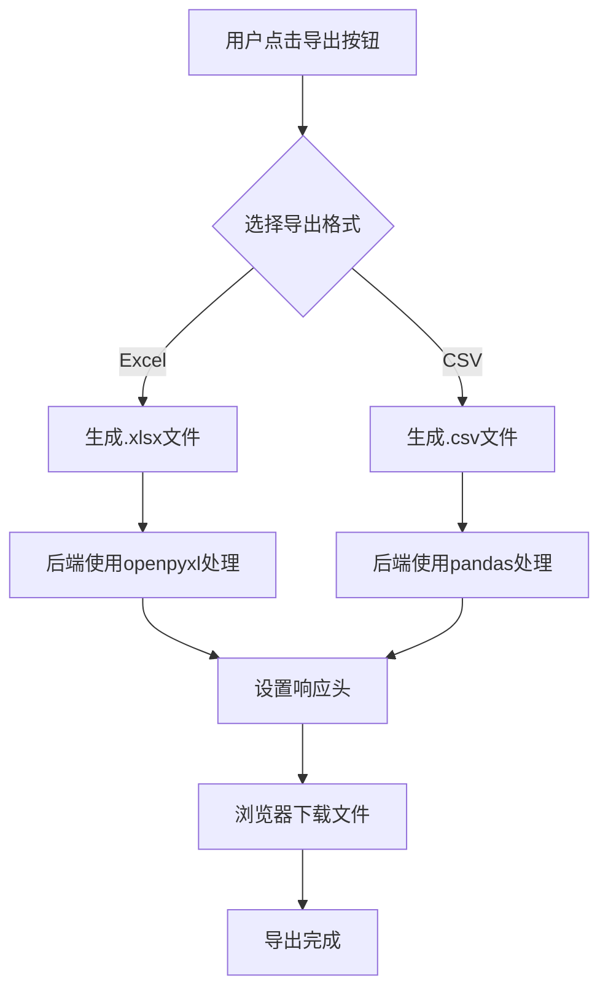
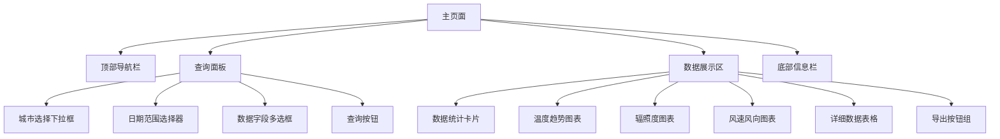
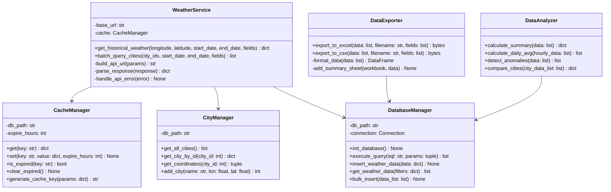
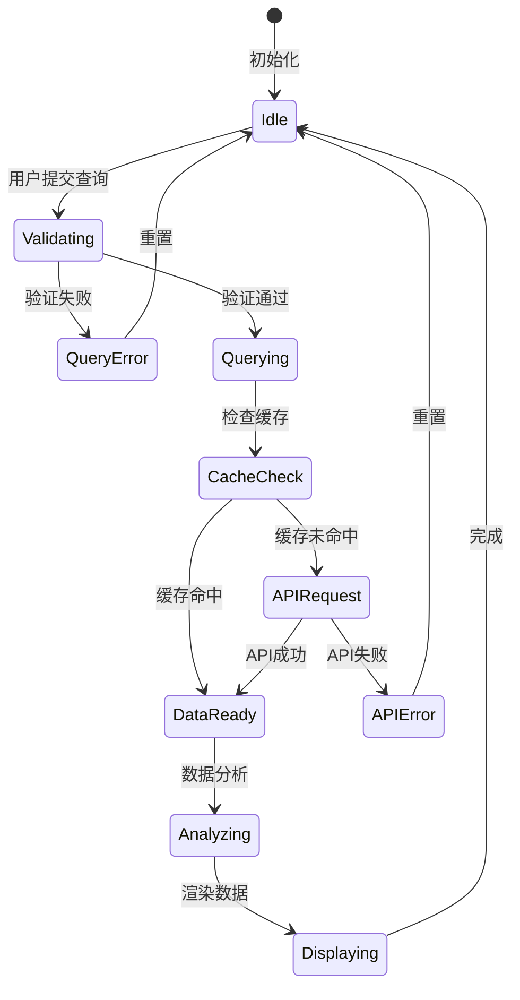
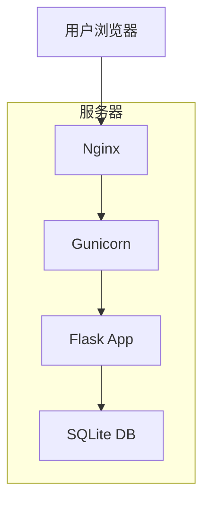

# 广西历史天气数据查询系统 - 项目需求规格说明书

## 1. 项目概述

### 1.1 项目名称
广西历史天气数据查询系统 (Guangxi Historical Weather Data System)

### 1.2 项目目标
开发一个基于Web的历史天气数据查询系统，能够从Open-Meteo API获取广西地区2022年至今的详细历史天气数据（包括辐照度、风速等），提供友好的UI界面供用户查询特定日期的天气信息，并支持数据导出功能。

### 1.3 核心功能
1. 从Open-Meteo API获取广西历史天气数据（2022年至今）
2. 提供详细的气象数据：温度、湿度、降水、气压、云量、**辐照度**、**风速**等
3. 提供直观的Web UI界面进行数据查询和可视化
4. 支持按日期范围查询天气数据（小时级精度）
5. 支持按城市/地区筛选（广西14个主要城市）
6. 支持将查询结果导出为Excel/CSV格式
7. 本地数据缓存，提升查询速度

### 1.4 数据字段详细说明

#### 基础气象数据
- **温度** (temperature_2m): 2米高度气温，单位：°C
- **相对湿度** (relative_humidity_2m): 2米高度相对湿度，单位：%
- **露点温度** (dew_point_2m): 2米高度露点温度，单位：°C
- **降水量** (precipitation): 小时降水量，单位：mm
- **降雨量** (rain): 小时降雨量，单位：mm
- **降雪量** (snowfall): 小时降雪量，单位：cm
- **气压** (surface_pressure): 地面气压，单位：hPa
- **云量** (cloud_cover): 总云量，单位：%

#### 风速数据（多高度）
- **10米风速** (wind_speed_10m): 10米高度风速，单位：km/h
- **10米风向** (wind_direction_10m): 10米高度风向，单位：°
- **10米阵风** (wind_gusts_10m): 10米高度阵风，单位：km/h
- **80米风速** (wind_speed_80m): 80米高度风速，单位：km/h
- **120米风速** (wind_speed_120m): 120米高度风速，单位：km/h
- **180米风速** (wind_speed_180m): 180米高度风速，单位：km/h

#### 辐照度数据
- **短波辐射** (shortwave_radiation): 短波太阳辐射，单位：W/m²
- **直接辐射** (direct_radiation): 直接太阳辐射，单位：W/m²
- **散射辐射** (diffuse_radiation): 散射太阳辐射，单位：W/m²
- **直接法向辐照度** (direct_normal_irradiance): DNI，单位：W/m²
- **全球水平辐照度** (global_tilted_irradiance): GHI，单位：W/m²
- **地表太阳辐射** (terrestrial_radiation): 地表向下长波辐射，单位：W/m²

#### 其他数据
- **能见度** (visibility): 能见度，单位：m
- **蒸发蒸腾量** (evapotranspiration): ET0参考蒸散发，单位：mm
- **土壤湿度** (soil_moisture_0_to_7cm): 0-7cm土壤湿度，单位：m³/m³
- **天气代码** (weather_code): WMO天气代码，描述天气情况

## 2. 技术架构与选型

### 2.1 整体架构
采用前后端分离架构



### 2.2 技术栈选型

#### 前端技术栈
- **HTML5**: 页面结构
- **CSS3**: 样式设计（玻璃态设计、深色主题、渐变效果）
- **Vanilla JavaScript**: 业务逻辑
- **Chart.js**: 天气数据可视化（温度曲线、辐照度图表、风速图表）
- **Google Fonts**: 现代字体（Inter）

#### 后端技术栈
- **Python 3.9+**: 主要开发语言
- **Flask**: Web框架
- **Flask-CORS**: 跨域支持
- **Requests**: HTTP客户端
- **SQLite**: 本地数据缓存
- **Pandas**: 数据处理和分析
- **openpyxl**: Excel导出
- **python-dotenv**: 环境变量管理

#### API服务
- **Open-Meteo Historical Weather API**: 历史天气数据源
  - **完全免费**: 无需API密钥，无调用限制
  - **数据范围**: 1940年至今（满足2022年至今需求）
  - **数据精度**: 小时级数据
  - **空间分辨率**: 约9-11km
  - **数据源**: ERA5、ERA5-Land等权威再分析数据集
  - **API端点**: `https://archive-api.open-meteo.com/v1/archive`

## 3. 数据模型

### 3.1 数据库设计



### 3.2 广西主要城市配置

| 城市 | 经度 | 纬度 |
|------|------|------|
| 南宁 | 108.3661 | 22.8172 |
| 柳州 | 109.4281 | 24.3264 |
| 桂林 | 110.2993 | 25.2736 |
| 梧州 | 111.2742 | 23.4769 |
| 北海 | 109.1195 | 21.4733 |
| 防城港 | 108.3548 | 21.6146 |
| 钦州 | 108.6544 | 21.9797 |
| 贵港 | 109.5986 | 23.1115 |
| 玉林 | 110.1810 | 22.6542 |
| 百色 | 106.6183 | 23.9015 |
| 贺州 | 111.5669 | 24.4038 |
| 河池 | 108.0854 | 24.6928 |
| 来宾 | 109.2211 | 23.7509 |
| 崇左 | 107.3645 | 22.3769 |

## 4. 系统流程图

### 4.1 数据查询流程



### 4.2 数据导出流程



## 5. API接口设计 (RESTful)

### 5.1 后端API接口

#### 5.1.1 获取城市列表
```
GET /api/cities
Response: 
{
  "code": 200,
  "data": [
    {
      "id": 1,
      "name": "南宁",
      "longitude": 108.3661,
      "latitude": 22.8172,
      "region": "广西"
    },
    ...
  ]
}
```

#### 5.1.2 查询历史天气
```
POST /api/weather/query
Request:
{
  "city_id": 1,
  "start_date": "2024-01-01",
  "end_date": "2024-01-31",
  "fields": ["temperature_2m", "wind_speed_10m", "shortwave_radiation"]
}

Response:
{
  "code": 200,
  "data": {
    "city": "南宁",
    "longitude": 108.3661,
    "latitude": 22.8172,
    "timezone": "Asia/Shanghai",
    "records": [
      {
        "datetime": "2024-01-01T00:00:00",
        "temperature_2m": 15.5,
        "relative_humidity_2m": 75,
        "precipitation": 0,
        "wind_speed_10m": 8.5,
        "wind_direction_10m": 45,
        "shortwave_radiation": 0,
        "direct_radiation": 0,
        "diffuse_radiation": 0,
        "direct_normal_irradiance": 0
      },
      ...
    ],
    "summary": {
      "avg_temperature": 16.8,
      "max_temperature": 22.3,
      "min_temperature": 12.1,
      "total_precipitation": 15.5,
      "avg_wind_speed": 9.2,
      "max_wind_speed": 18.5,
      "total_solar_radiation": 12500.5
    }
  }
}
```

#### 5.1.3 导出数据
```
POST /api/weather/export
Request:
{
  "city_id": 1,
  "start_date": "2024-01-01",
  "end_date": "2024-01-31",
  "format": "excel", // or "csv"
  "fields": ["temperature_2m", "wind_speed_10m", "shortwave_radiation"]
}

Response: 文件流 (application/vnd.ms-excel 或 text/csv)
```

#### 5.1.4 获取可用数据字段
```
GET /api/fields
Response:
{
  "code": 200,
  "data": {
    "basic": ["temperature_2m", "relative_humidity_2m", ...],
    "wind": ["wind_speed_10m", "wind_speed_80m", ...],
    "radiation": ["shortwave_radiation", "direct_radiation", ...],
    "other": ["visibility", "evapotranspiration", ...]
  }
}
```

## 6. 前端UI设计

### 6.1 页面布局



### 6.2 设计风格
- **配色方案**: 
  - 主色调: 深蓝渐变 (#0f172a → #1e40af)
  - 辅助色: 天空蓝 (#0ea5e9)、橙色（辐照度）(#f97316)、绿色（风速）(#10b981)
  - 背景色: 深色主题 (#0f172a)
  - 卡片背景: 半透明玻璃态 (rgba(255,255,255,0.05))
  - 文字色: 白色/浅灰 (#f1f5f9)
- **视觉效果**:
  - 玻璃态效果 (Glassmorphism)
  - 卡片阴影和悬停动画
  - 平滑过渡效果 (transition: all 0.3s ease)
  - 数据加载骨架屏
  - 渐变边框效果
- **字体**: Inter (Google Fonts)
- **图标**: 自定义SVG天气图标 + 数据图标

### 6.3 数据可视化设计
- **温度趋势图**: 折线图，显示温度随时间变化
- **辐照度图表**: 面积图，显示不同类型辐射的分布
- **风速风向图**: 组合图（柱状图+风向玫瑰图）
- **降水量图**: 柱状图
- **数据对比图**: 多城市对比雷达图

## 7. 核心类设计 (后端)

### 7.1 类图



### 7.2 核心方法说明

#### WeatherService
- **职责**: 与Open-Meteo API交互，获取和处理天气数据
- **单一职责**: 仅负责天气数据的获取和初步处理
- **依赖注入**: 通过构造函数注入CacheManager和CityManager

#### CacheManager
- **职责**: 管理API响应缓存，减少API调用次数
- **开闭原则**: 可扩展支持Redis等其他缓存方式
- **缓存策略**: 历史数据缓存30天（因为历史数据不会改变）

#### DataExporter
- **职责**: 将数据导出为不同格式
- **接口隔离**: 每种导出格式独立方法
- **功能**: 支持自定义字段导出、添加汇总表

#### DataAnalyzer
- **职责**: 数据分析和统计
- **功能**: 计算统计摘要、日均值、异常检测、城市对比

## 8. 状态图

### 8.1 数据查询状态



## 9. 部署方案

### 9.1 本地部署


### 9.2 生产部署（可选）



## 10. 开发计划

### 10.1 开发阶段

#### 阶段一: 项目初始化 (Day 1)
1. 创建项目目录结构
2. 初始化Git仓库
3. 创建虚拟环境
4. 安装依赖包
5. 创建配置文件

#### 阶段二: 后端基础 (Day 1-2)
1. 实现DatabaseManager
2. 实现CityManager
3. 配置广西14个城市数据
4. 数据库初始化脚本
5. 单元测试

#### 阶段三: API集成 (Day 2-3)
1. 实现CacheManager
2. 实现WeatherService
3. 测试Open-Meteo API集成
4. 实现数据解析逻辑
5. 单元测试

#### 阶段四: RESTful API (Day 3-4)
1. 实现Flask路由
2. 实现查询接口
3. 实现导出接口
4. 实现字段管理接口
5. API测试

#### 阶段五: 数据分析 (Day 4)
1. 实现DataAnalyzer
2. 实现统计摘要功能
3. 实现数据对比功能
4. 单元测试

#### 阶段六: 前端UI (Day 5-6)
1. HTML结构设计
2. CSS样式实现（玻璃态设计）
3. JavaScript交互逻辑
4. Chart.js图表集成
5. 响应式设计

#### 阶段七: 集成测试 (Day 6-7)
1. 前后端联调
2. E2E测试
3. 性能优化
4. Bug修复

#### 阶段八: 文档和部署 (Day 7)
1. 完善README
2. 编写使用文档
3. 创建GitHub仓库
4. 代码提交

### 10.2 测试策略
- **单元测试**: pytest覆盖后端核心类
- **集成测试**: 测试API端到端流程
- **E2E测试**: 使用浏览器测试完整用户流程
- **测试日志**: 记录到logs/debug.log

## 11. 技术优势与限制

### 11.1 Open-Meteo API优势
✅ **完全免费** - 无需API密钥，无调用限制  
✅ **长期数据** - 支持1940年至今（满足2022年需求）  
✅ **数据详细** - 包含辐照度、多高度风速等  
✅ **高精度** - 基于ERA5等权威数据集  
✅ **全球覆盖** - 包括中国广西地区  
✅ **开源项目** - 数据透明，社区活跃  

### 11.2 技术限制
⚠️ **空间分辨率** - 约9-11km，不是精确到气象站点  
⚠️ **数据延迟** - 历史数据有5天延迟  
⚠️ **网络依赖** - 需要稳定的互联网连接  
⚠️ **数据量** - 长时间范围查询可能较慢（通过缓存优化）  

### 11.3 性能优化策略
1. **智能缓存**: 历史数据缓存30天
2. **批量查询**: 一次API调用获取多天数据
3. **异步加载**: 前端分批渲染大量数据
4. **数据压缩**: 缓存使用JSON压缩
5. **索引优化**: 数据库添加适当索引

## 12. 后续优化方向
1. 支持更多城市（全国范围）
2. 添加天气预测功能（使用Open-Meteo预报API）
3. 实现用户账户系统
4. 数据可视化增强（3D图表、动画效果）
5. 移动端适配（响应式设计）
6. 数据分析功能（趋势分析、异常检测、气候模式识别）
7. 数据对比功能（多城市、多时段对比）
8. 导出报告功能（PDF格式，包含图表和分析）
9. 数据API开放（为其他应用提供数据接口）
10. 实时预警功能（极端天气提醒）
## 13. [2026-01-27] 已完成的功能改进
系统已完成以下 11 项核心改进和修复：

1.  ✅ **下载进度条与取消**：实现在数据管理面板的分段下载逻辑，前端展示进度并支持取消。
2.  ✅ **自动同步数据**：查询路由整合了自动保存逻辑，确保查询即入库。
3.  ✅ **主流城市扩展**：在 `config.py` 中加入了北京、上海、广州等全国主要城市。
4.  ✅ **辐射单位优化**：新增 `kWh/m²` 全球单位换算，解决用户对总计值的疑虑。
5.  ✅ **macOS 自动化脚本**：编写 `start.command`，简化部署流程。
6.  ✅ **统一状态监控**：前端新增 Ping 机制，实时反馈后端存活状态。
7.  ✅ **高效导航**：页眉增加锚点导航，方便在长页面中快速定位。
8.  ✅ **日期选择约束**：限制日期选择范围至昨日，并在前端根据限制自动纠错。
9.  ✅ **快捷日期区间**：增加 7~365 天的快捷填充按钮。
10. ✅ **导出功能修复**：修正导出请求中 `city_id` 的传递逻辑，解决 400 错误。
11. ✅ **UI/UX 细节打磨**：优化了各面板的交互反馈和样式表现。
12. ✅ **天气整体情况显示**：在统计卡片和详细数据表中新增天气图标与文字描述（由 WMO 代码转换）。
13. ✅ **批量导出完整数据**：在数据管理面板新增“导出选定范围数据到本地”的功能，支持一次性导出多个城市的全部气象字段。
14. ✅ **代码逻辑重构**：提取公共查询逻辑至 `common.js`，减少冗余并提升代码复用性。
15. ✅ **数据管理增强**：完善数据管理面板，实现按城市/日期的批量删除功能和数据完整性检查。
16. ✅ **UI风格升级**：全面采用Apple风格的浅色主题（Light Mode），优化配色、阴影和圆角设计，提升视觉体验。
17. ✅ **单位标准化**：后端与前端统一将风速单位由 km/h 调整为 m/s，符合国内气象标准。
18. ✅ **系统稳定性修复**：修复了SQLite多线程访问问题和潜在的文件缺失异常，增强了系统的健壮性。
19. ✅ **全自动本地优先 (Local-First)**：重构查询逻辑，系统优先检查 `weather_data` 永久表。若本地数据满足时段完整性，则直接从本地读取，彻底解决重复请求问题并支持离线查询。
20. ✅ **高精度图表交互**：升级 Chart.js 交互配置，实现全自动吸附提示框 (Tooltip)，支持多城市数据同步悬浮展示，并优化了高对比度的视觉样式。
21. ✅ **GitHub 自动化同步**：通过 Git 集成将完整项目及文档同步至 GitHub 仓库，便于多版本管理与分发。

## 14. [2026-01-28] 功能改进计划

### 14.1 数据导出优化
- **取消汇总表**：在导出 Excel/CSV 时，移除“汇总信息”工作表或区块，专注于展示原始小时数据和关键统计，简化导出格式。

### 14.2 统计指标增强
- **新增日度汇总指标**：
  - **日辐照量 (MJ/m²)**：由小时级短波辐射功率 (W/m²) 计算日积分得出。
  - **日平均风速 (m/s)**：基于 24 小时 10 米风速的平均值。

### 14.3 地理定位功能扩展
- **坐标输入支持**：在“数据管理 - 城市管理”面板中，增加“手动输入坐标”功能。
- **自定义命名**：允许用户为输入的坐标点设置自定义名称（如“项目地1”、“实验站B”），并将其作为虚拟城市保存到本地数据库中进行管理和查询。

### 14.4 文档同步
- 持续更新 `spec.md`、`README.md` 和 `update.md` 以确保项目记录的完整性。
